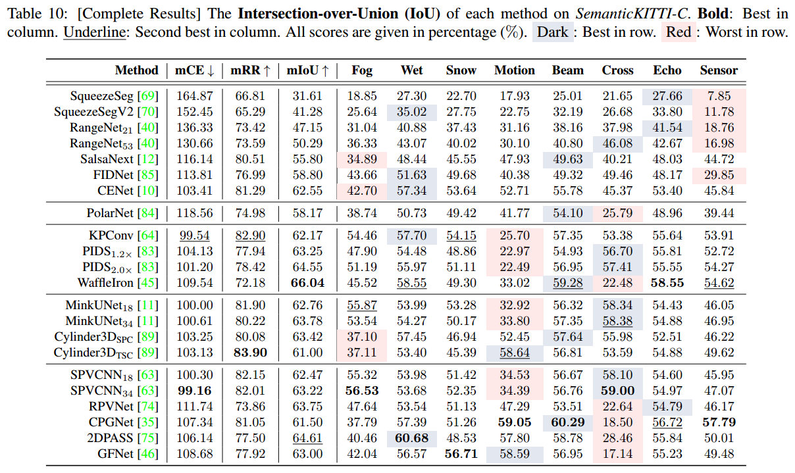

# CENet: Toward Concise and Efficient LiDAR Semantic Segmentation for Autonomous Driving 

Code for our paper:
> **CENet: Toward Concise and Efficient LiDAR Semantic Segmentation for Autonomous Driving**
>  Huixian Cheng, Xianfeng Han, Guoqiang Xiao 
> Accepted by ICME2022

## Abstract：
Accurate and fast scene understanding is one of the challenging task for autonomous driving, which requires to take full advantage of LiDAR point clouds for semantic segmentation. 
In this paper, we present a concise and efficient image-based semantic segmentation network, named CENet. 
In order to improve the descriptive power of learned features and reduce the computational as well as time complexity, 
our CENet integrates the convolution with larger kernel size instead of MLP, carefully-selected activation functions, 
and multiple auxiliary segmentation heads with corresponding loss functions into architecture. 
Quantitative and qualitative experiments conducted on publicly available benchmarks, SemanticKITTI and SemanticPOSS, 
demonstrate that our pipeline achieves much better mIoU and inference performance compared with state-of-the-art models.

## Updates:
**2023-03-28[NEW:sparkles:]** CENet achieves competitive performance in robustness evaluation at SemanticKITTI. See Repo of [Robo3D](https://github.com/ldkong1205/Robo3D) for more details.

  

 

**2022-07-06[:open_mouth::scream::thumbsup:]** [Ph.D. Hou](https://github.com/cardwing) reported an astounding 67.6% mIoU test performance of CENet, see [this issue](https://github.com/huixiancheng/CENet/issues/7) and [PVD Repo](https://github.com/cardwing/Codes-for-PVKD) for details.

**2022-03-28[:sunglasses:]** Suggested by reviewer, renamed to CENet.

**2022-03-07[:yum:]** SENet was very lucky to be ~~provisionally~~ accepted by ICME 2022.

**2021-12-29 [:sunglasses:]** Release models and training logs, which also contains ablation studies. (Please note that due to multiple updates of the code, some models and configs have inconsistencies that lead to errors, please make corresponding changes according to the specific situation.)

## Prepare:
Download SemanticKITTI from [official web](http://www.semantic-kitti.org/dataset.html). Download SemanticPOSS from [official web](http://www.poss.pku.edu.cn./download.html).

## Usage：
### Train：
- SemanticKITTI:

    `python train.py -d /your_dataset -ac config/arch/senet-512.yml -n senet-512`

    Note that the following training strategy is used due to GPU and time constraints, see [kitti.sh](https://github.com/huixiancheng/SENet/blob/main/kitti.sh) for details.

    First train the model with 64x512 inputs. Then load the pre-trained model to train the model with 64x1024 inputs, and finally load the pre-trained model to train the model with 64x2048 inputs.
    
    Also, for this reason, if you want to resume training from a breakpoint, uncomment [this section](https://github.com/huixiancheng/SENet/blob/c5827853ee32660ad9487a679890822ac9bf8bf8/modules/trainer.py#L193-L203) and change "/SENet_valid_best" to "/SENet".

- SemanticPOSS:

    `python train_poss.py -d /your_dataset -ac config/arch/poss.yml -n res`

### Infer and Eval：
- SemanticKITTI:

    `python infer.py -d /your_dataset -l /your_predictions_path -m trained_model -s valid/test`
    
    Eval for valid sequences:

    `python evaluate_iou.py -d /your_dataset -p /your_predictions_path`

    For test  sequences, need to upload to [CodaLab](https://competitions.codalab.org/competitions/20331#participate) pages.

- SemanticPOSS:

    `python infer_poss.py -d /your_dataset -l /your_predictions_path -m trained_model`

    This will generate both predictions and mIoU results.

### Visualize Example:

- Visualize GT:

  `python visualize.py -w kitti/poss -d /your_dataset -s what_sequences`

- Visualize Predictions:

  `python visualize.py -w kitti/poss -d /your_dataset -p /your_predictions -s what_sequences`

## Pretrained Models and Logs:
| **KITTI Result** | **POSS Result** | **Ablation Study** | **Backbone HarDNet** |
| ---------------- | --------------- | ------------------ | -------------------- |
| [Google Drive](https://drive.google.com/file/d/167ofUNdkVnRoqZ28NAXRjykdVWnublUk/view?usp=share_link) | [Google Drive](https://drive.google.com/file/d/1DC66ky6k2aBpVg1Md1AR2tjqHzSYL5xC/view?usp=sharing) | [Google Drive](https://drive.google.com/file/d/1axrBYJflKMn0FLoC6HoN1G4RUmitIP1U/view?usp=sharing) | [Google Drive](https://drive.google.com/file/d/1afer0OX0WzxoMIWXV-btGVC7llt-4nUB/view?usp=sharing) |

## TODO List:
- [x] Release Pretrained Model and Logs.
- [ ] Try TensorRT acceleration.
- [ ] To make NLA adaptation framework, See [here](https://github.com/huixiancheng/SENet/blob/57d3e07777099c805fa27ceda68e359b2b7ae12d/modules/user.py#L178-L194).

## Acknowledgments：
Code framework derived from [SalsaNext](https://github.com/Halmstad-University/SalsaNext). Models are heavily based on [FIDNet](https://github.com/placeforyiming/IROS21-FIDNet-SemanticKITTI). Part of code from [SqueezeSegV3](https://github.com/chenfengxu714/SqueezeSegV3). Thanks to their open source code, and also to [Ph.D. Zhao](https://github.com/placeforyiming) for some helpful discussions.

## Citation：
~~~
@inproceedings{cheng2022cenet,
  title={Cenet: Toward Concise and Efficient Lidar Semantic Segmentation for Autonomous Driving},
  author={Cheng, Hui--Xian and Han, Xian--Feng and Xiao, Guo--Qiang},
  booktitle={2022 IEEE International Conference on Multimedia and Expo (ICME)},
  pages={01--06},
  year={2022},
  organization={IEEE}
}
~~~
